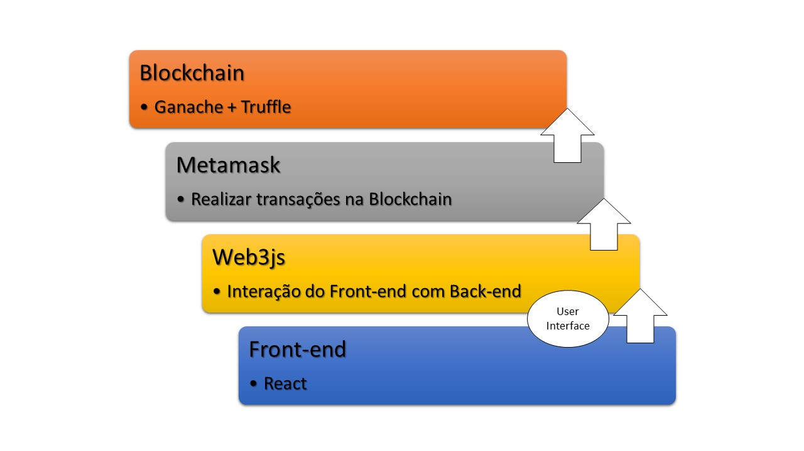
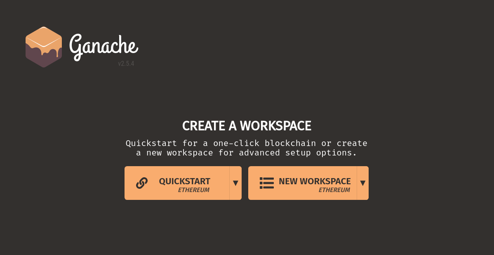
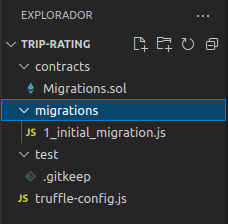
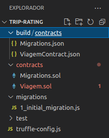
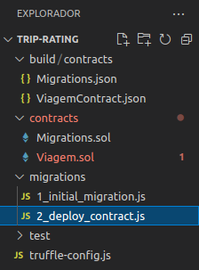
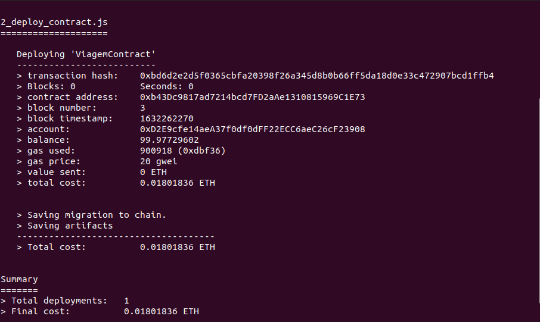
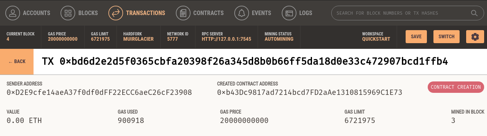
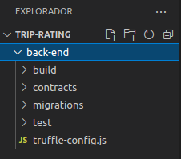
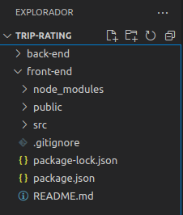
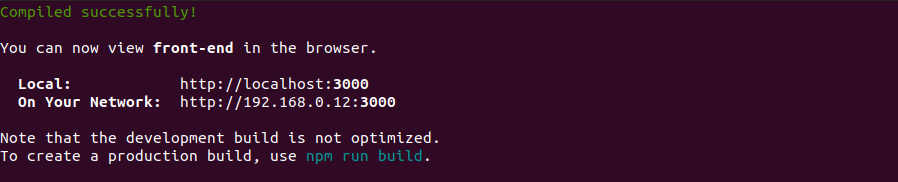

<h1 align="center">Projeto - Votação usando a tecnologia Blockchain</h1>

Aprenda como desenvolver uma aplicação descentralizada (DApp) utilizando as tecnologias Truffle, Ganache, Metamask, Web3js React.

Abaixo o Roadmap que ilustra as etapas do projeto.



No projeto, criaremos um smart contract em solidity e faremos o deploy dele pelo Truffle, o deploy será na Blockchain criada pelo Ganache.
Utilizaremos o Metamask para fazer a comunicação com a Blockchain e o React para criar a interface web da aplicação. 

A aplicação vai simular um sistema de votação, onde qualquer usuário poderá cadastrar uma nova opção de votação e votar nas opções já existentes.


## Deploy do Smart Contract

Para o deploy do projeto será necessário instalar o Visual Studio Code(link), Truffle(link), Ganache(link) e baixar o smart contract.
Você pode encontrar a pasta **projeto-voting** contendo o smart contract com o nome de _Voting.sol_ nesse link. 

Para iniciar o projeto precisamos fazer o deploy do smart contract, siga os passos abaixo no terminal:

- 1º Inicie o Ganache pelo aplicativo e clique em QuickStart:



- 2º Crie uma pasta para o projeto:
```
mkdir voting
```
- 3º Entre no diretório criado:
```
cd voting
```
- 4º No diretório **voting** inicialize o truffle:
```
truffle init

truffle unbox react

cd client
npm run start

```

- 5º Abra a pasta **voting** no Visual Studio Code

Note que o truffle criou algumas pastas, seu diretório deve estar assim:



- 6º Coloque o smart contract _Voting.sol_ dentro da pasta **contracts**
- 7º Voltando ao terminal, execute o comando:
```
truffle compile
```

Note que o truffle criou uma pasta chamada **build**, dentro dela tem 2 arquivos JSON: 



- 8º Crie um arquivo para o deploy dentro da pasta **migrations**, coloque o nome de _2_deploy_contract.js_:



- 9º No arquivo _2_deploy_contract.js_ cole o código abaixo:
```
const Voting = artifacts.require("VotingContract");
module.exports = function(deployer) {
     deployer.deploy(Voting);
};
```
- 10º No arquivo _truffle-config.js_ cole o código abaixo:
```
module.exports = {
    networks: {
       development: {
          host: "127.0.0.1",
          port: 7545, // Porta padrão em que o ganache utiliza
          network_id: "*"
       }
    }, 
    solc: {
       optimizer: {
          enabled: true,
          runs: 200
       }
    }
}
```
- 11º No terminal, execute o comando:
```
truffle migrate
```

Se ocorrer tudo certo, receberemos o log abaixo no terminal:




Parabéns, você fez o deploy do smart contract. Vamos analisar o que temos até aqui:

- client/: Arquivos React App para o front-end.
- client/public/: Arquivos web estáticos.
- client/src/: Arquivos source para o React App.
- contracts/: Smart Contracts.
- migrations/: instruções para a migração dos Smart Contracts.
- test/: Test dos Smart Contracts
- truffle-config.js: Arquivo de configuração.

Agora precisamos confirmar se a transação foi gravada no Ganache. Abra a aba Transactions e verifique se a transação foi registrada:




## Criar uma aplicação Web

Crie uma pasta chamada **back-end** e coloque todos os arquivos feito até então:




Para a aplicação Web funcionar precisamos instalar o react, abra um novo terminal e cole o código abaixo:
```
sudo npm install -g create-react-app
```

Então volte para o diretório **voting** e digite:
```
create-react-app front-end
```
Agora dividimos o projeto em 2 pastas:


Na pasta **front-end** devemos ter os seguintes arquivos:



Pelo terminal, dentro do diretório **front-end** digite o código abaixo para testar a aplicação Web recém criada:
```
npm start
```
Devemos ter a tela assim:



Agora vamos baixar os pacotes react:
```
npm install --save react-router-dom@4.3.1
``` 
npm install --save semantic-ui-react
```
Precisamos criar uma pasta para os componentes react dentro do diretório **src** e nessa pasta vamos colocar os arquivos do **projeto-voting**:


ALTERAR OS ARQUIVOS HOME.JS E VIAGEM.JS

PROJETO EM ANDAMENTO


