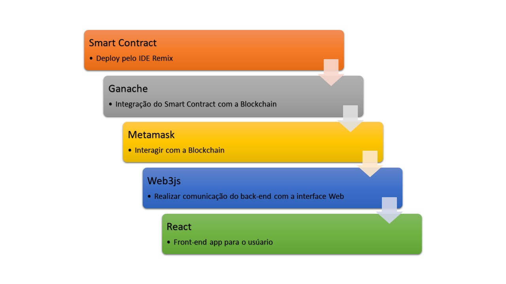

<h1 align="center">Projeto - Avaliação de pontos turísticos usando a tecnologia Blockchain</h1>

Aprenda como desenvolver uma aplicação descentralizada (DApp) utilizando 
a as tecnologias Solidity, Ganache, Metamask, Web3js e React. 

Abaixo o Roadmap que ilustra as etapas do projeto.

No projeto, criaremos um smart contract em solidity e faremos o deploy dele pelo IDE REMIX, o deploy será na Blockchain criada pelo Ganache.
Utilizaremos o Metamask para fazer a comunicação com a Blockchain e o React para criar a interface web da aplicação. 

A aplicação vai simular um sistema de avaliação de pontos turísticos, onde qualquer usuário poderá cadastrar um novo ponto turístico usando como base a localização no google maps. Na avaliação o usuário deverá considerar alguns aspectos como paisagem, preço, segurança, acessibilidade, um breve resumo da experiência e por fim se recomenda ou não a visita.

## Deploy do Smart Contract

Para o projeto será necessário instalar o Ganache(link), Nodejs(link) e baixar o smart contract.
Você pode encontrar o arquivo **trip-rating** contendo o smart contract nesse link. 

Para iniciar o projeto precisamos fazer o deploy do smart contract obtido acima, primeiro acesse o site do IDE Remix por esse link.

- 1º Passo:
No IDE REMIX crie um novo arquivo e nomeie-o de _rating.sol_

- 2º Passo:
Copie o conteudo do arquivo _smartcontract.sol_ dentro da pasta **trip-rating** e então cole no arquivo _rating.sol_ criado no IDE REMIX.

No menu do lado esquerdo você terá a opção de compilação, deixe o menu configurado conforme abaixo:

Antes de clicar em deploy precisamos fazer alguns ajustes, primeiro abra o Ganache e clique em Quickstart Blockchain:

Assim que o Ganache for iniciado, voltamos para a IDE Remix e vamos selecionar a terceira opção do menu Esquerdo para realizar o deploy. 
Na primeira opção Environment, está selecionado o item JavaScript VM, vamos alterar para Web3 Provider para que possamos informar nosso endereço do Ganache. 
Feito isso, clique em Ok e aguarde o processamento até que a integração entre IDE Remix e Ganache seja finalizada. Sua tela deve estar assim:

Precisamos confirmar se a transação foi gravada no Ganache. Abra a aba Transactions e verifique se a transação foi registrada:

Se você chegou até aqui parabéns, finalizamos o back-end da nossa aplicação. 

Precisamos criar a interação do back-end com o front-end, para isso copie o endereço do campo CREATED CONTRACT ADDRESS do Ganache, pois vamos precisar informar esse endereço dentro do React. Vamos precisar também copiar o ABI gerado do deploy que realizamos no IDE REMIX, selecione novamente a segunda opção Solidity Compiler do menu esquerdo e 
então clique no link ABI:

Após copiar os dois dados, guarde em um arquivo de texto e então finalizamos o deploy do smart contract na Blockchain.

Sempre que for feito um novo deploy do smart contract, copie o arquivo ABI.json do IDE REMIX e o valor do campo CREATED CONTRACT ADDRESS do Ganache, pois temos que informá-los no React.

## Configuração da aplicação Web

